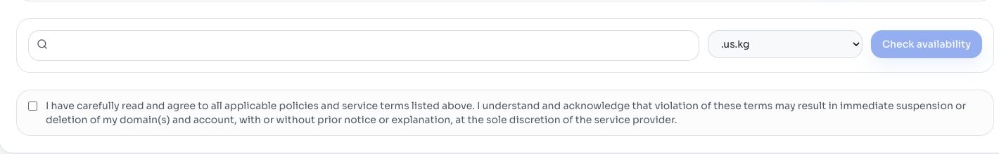

> 🌐 本文档由 [DigitalPlatDev/FreeDomain](https://github.com/DigitalPlatDev/FreeDomain) 翻译,英文原版见原项目。

# 注册免费域名

本章介绍 DigitalPlat 的注册流程。常规 DNS 记录稍后会在外部 DNS 服务中配置。

## 先阅读最新通知

打开控制面板的通知栏。支持的后缀、注册暂停、名额要求、价格、限制、续期窗口和政策都可能变化。

不要把旧截图当作当前可用性或费用的依据。

## 准备外部域名服务器

注册流程可能要求填写权威域名服务器主机名。先在外部 DNS 服务中创建目标区域,并复制每一个分配到的域名服务器。

示例格式:

```text
ns1.dns-service.example
ns2.dns-service.example
```

这些是主机名,既不是 DNS 解析器地址,也不是网站 IP 地址。

## 打开注册页面

在控制面板中选择 **Register**。



阅读你打算选择的后缀所关联的政策。

## 检查名称

1. 输入想要的名称标签。
2. 选择后缀。
3. 点击 **Check availability**。
4. 核对生成的完整域名。
5. 核对显示的名额或付费要求。

避免使用冒充他人、侵犯权利、误导用户或违反当前政策的名称。

## 谨慎提交

最终提交前,检查:

- 完整域名拼写
- 所选后缀
- 外部域名服务器主机名
- 注册人信息
- 政策确认
- 控制面板显示的名额或费用

注册会创建外部状态,可能消耗名额或产生费用。发现任何数值与预期不符时,立即停止。

## 确认结果

打开 **Domain List**,找到确切的域名,并私下记录其状态与到期日期。

如果结果显示 pending 或被拒绝,应根据显示的原因排查。可能原因包括:名称不可用、外部域名服务器无效、注册数据不完整,或当前命名空间限制。

继续阅读[接入外部域名服务器](./1.3-connect-nameservers.md)。
